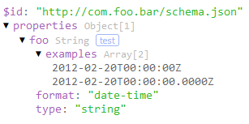
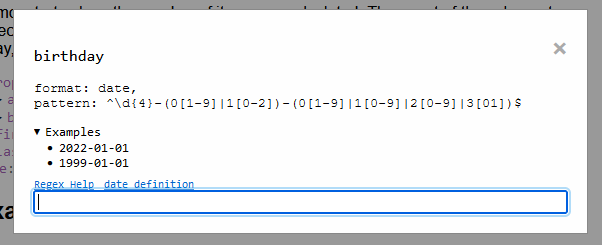

# JSON Schema Explorer
JSON Schema Explorer is a lightweight, all-in-one solution for browsing and exploring your JSON schemas.

This is a customizable solution, where you have creative freedom on CSS and options to fit the style to your needs.

<a href="https://soulshined.github.io/json-schema-explorer" target="_blank">DEMO</a>

## Features
- Small, portable, footprint: ~18kb library
- Syntax Highlighting
    - 
- Semantic counts of schema properties or array/enum lengths at a glance
- See what type the schema is at a glance
- Options to customize style
- Interactive playground for string format/pattern based schemas
    
    - Users can test schemas by typing text directly in the explorer
    - Out-of-box RFC complaint validation for supported formats
    - Links to formal documentation for RFC spec definitions
    - Links to MDN documentation for Regular Expression Cheatsheets
    - When a JSON [`format`](https://json-schema.org/understanding-json-schema/reference/string.html#id7) keyword is used in a string type schema the pattern is automatically supplied (in the playground only, it does not alter your schema), unless you provide your own. The supported format types default to it's respective RFC spec. A documentation link is also provided for these schemas
        - You can review the supported `format` types [below](#String-input-playground-supported-formats)

## What JSON Scema Explorer **Isn't**
- This ***isn't*** a schema validator. This library assumes your schema __is well-formed__ and is only intended to display it in a human-readable manner
- Doesn't resolve extended/base schemas or `$refs` or `$defs`
    - This is not intended to be a uri or relative file resolver

## Usage

1) Import the library
    - Download locally to your project and import into your HTML file
    - via JSDelivr
        ```html
        <head>
            ...
            <script src="https://cdn.jsdelivr.net/gh/soulshined/json-schema-explorer@v1.3.1/dist/JsonSchemaExplorer.min.js"></script>
            ...
        </head>
        ```
2) Create an instance of the explorer.
    > The JsonSchemaExplorer object is a subclass of an HTMLElement and registered with your browser so you can interact with and query it just like any DOM object

    - javascript object (supports options)
        ```js
        const explorer = new JsonSchemaExplorer(schema, options);
        explorer.id = 'mySchemaExplorer';
        ```
    - javascript document element (doesn't support options)
        ```js
        const explorer = document.createElement('json-schema-explorer');
        explorer.schema = schema;
        explorer.id = 'mySchemaExplorer';
        ```
3) Add the instantiated object to the document element of your choice:
    ```js
    document.body.appendChild(explorer);
    ```

## Options
```js
const options = new JsonSchemaExplorerOptions();
```

### Properties:
- `minifySimpleTypes` &lt;boolean&gt; `true`

    If a property schema only has the `type` keyword set, this flag will not show a dropdown toggle and simply type the name of the `type` as it's value

    For example:

    ```json
    {
        "properties": {
            "foo" : {
                "type": "string"
            }
        }
    }
    ```

    Will be simplifed to:
    ```
    properties: {
        "foo" : "string"
    }
- `sortKeys` &lt;boolean&gt; `true`

    This flag identifies if the schema output should be ordered by the keys

- `expand` &lt;object&gt; `{ root: true, examples: false }`;

    This object defines how you want your dropdowns to expand by default

    - `root` `true`
        - `true` or `false`
        - This only opens items at the root level of a schema if they are toggable
    - `examples` `false`
        - `true` or `false` or `<##`
            - If `true` expands all `examples` elements by default
            - If `false` never expands by default
            - If a string
                - String must start with a `<` to identify 'less than'
                - After the `<` a valid integer is required. This number identifies that you want the `examples` element to always expand if it has less than the amount of values you indicated
                    - You must provide a postitive number
                    - Example:
                        - `'<10'` - only expand by default if there are less than 10 items

## String input playground supported formats

The [`format`](https://json-schema.org/understanding-json-schema/reference/string.html#id7) keyword identifies what time of format a string is expected to be. As the json schema spec states, it does not guarantee validation, though most json schema validators have an option to enable this or is enabled by default.

The out-of-box playground included with this library acts as a way for consumers/users of your schemas to play around with text according to the schemas definition.

Currently, this library's playground only supports the following built-in `format` types:

- `date-time`
- `time`
- `date`
- `duration`
- `hostname`
- `ipv4`
- `ipv6`
- `uuid`
- `uri`
- `json-pointer`
- `regex`

Additionally, if you don't include a `format` type but do include a `pattern` keyword, the playground will use the pattern you provide and validate using that. If your pattern is not well-formatted, the pop-up will still show, but there will not be an `<input>` element for users/consumers to try it out with

When a supported `format` keyword is used in a string type schema, the regex pattern is automatically supplied to the playground, you do not need to include a pattern. Additionally, a documentation link is also provided for these schemas for users to review if they don't understand why their text does not pass validation.

You can review the [examples/demos](https://soulshined.github.io/json-schema-explorer/) page to explore this feature

## CSS Selectors

As noted above, because a json-schema-explorer is a subclass of `HTMLElement` you can target it by using it's name as the selector directly:

```css
json-schema-explorer { }
```

### For datatypes:

```css
json-schema-explorer .key { color: #a563b7; }

json-schema-explorer .key.const,
json-schema-explorer .key.const + span {
    /* Specifically for the `const` keyword in json schemas */
    color: orange;
}
json-schema-explorer .\#text,
json-schema-explorer .separator {
    /*
        .#text are plan text values (for things like arrays or otherwise)
        .separator is the `:` between a key and a value
     */
    color: rgba(0, 0, 0, 0.6);
}
json-schema-explorer .string {
    /* this includes the quotation marks */
    color: #31B72C;
}
json-schema-explorer .boolean { color: #56B5F0; }
json-schema-explorer .number,
json-schema-explorer .integer {
    color: #D38B5D;
}
json-schema-explorer .null { color: #BC2C1A; }
```

### For deprecated schemas:
```css
json-schema-explorer .deprecated {
    text-decoration: line-through;
    text-decoration-color: lightgrey;
    opacity: .6;
}
```